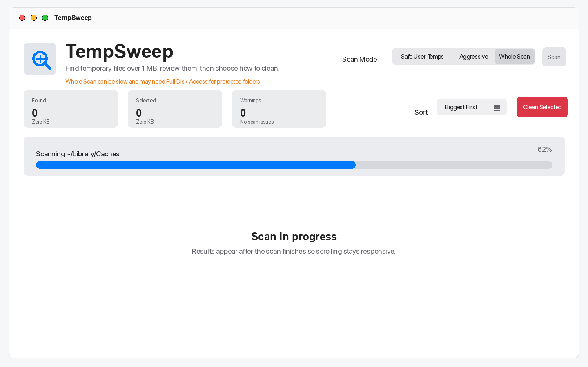
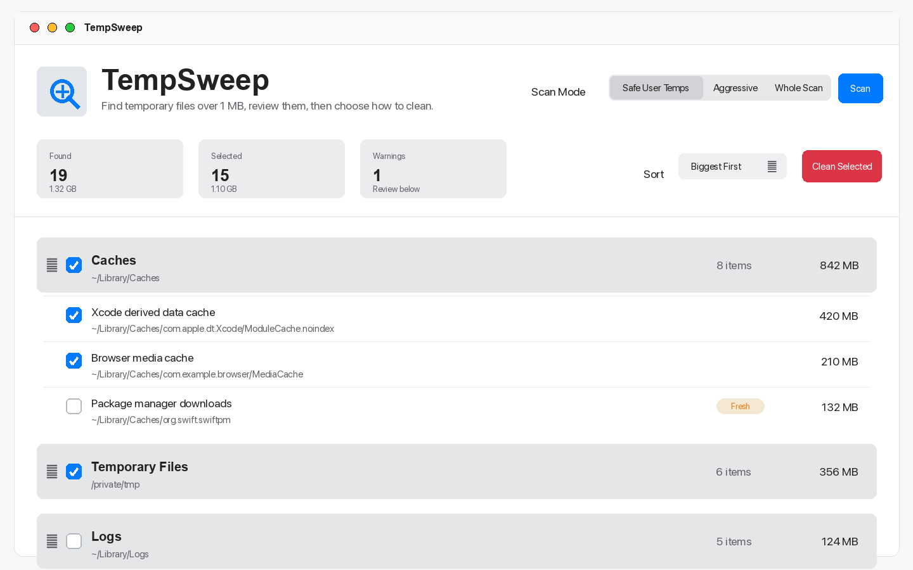
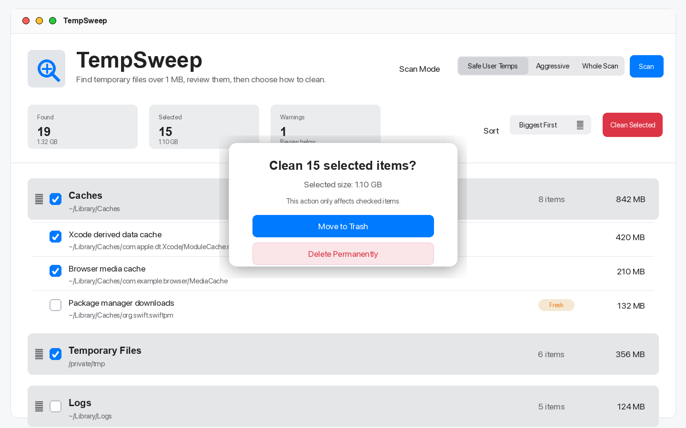

# TempSweep

TempSweep is a lightweight macOS cleaner for finding bigger temporary, cache, and log files. It focuses on review-before-delete workflows: scan, sort by size, inspect paths, choose files, then move selected items to Trash or delete them permanently.

TempSweep is intentionally conservative. It skips tiny files by default, avoids system-critical directories, limits huge result rendering for stability, and requires explicit confirmation before cleaning.

## Screenshots







## Features

- Finds bigger temp, cache, and log files
- Sorts results by size
- Lets you review paths and choose what to delete
- Moves files to Trash or permanently deletes with confirmation
- Shows scan progress and permission warnings

## Safety Model

- Files smaller than 1 MB are hidden by default to reduce noise.
- Fresh files are shown but left unchecked by default.
- Symlinks, app bundles, package contents, system-critical directories, `.Trash`, `.git`, and `node_modules` are skipped.
- Whole Scan only surfaces temp/cache/log-looking files.
- Cleaning never happens automatically after a scan.

## Requirements

- macOS 14 or newer
- Xcode command line tools or Xcode with Swift 6-compatible tooling

## Build And Run

```bash
./script/build_and_run.sh
```

This builds a local unsigned app bundle at `dist/TempSweep.app` and launches it.

## Test

```bash
swift test
```

## Package Only

```bash
scripts/package_app.sh
```

This creates `dist/TempSweep.app`.

## Full Disk Access

macOS may block access to protected folders during broader scans. If TempSweep shows scan warnings, open **System Settings > Privacy & Security > Full Disk Access**, add or enable TempSweep, then quit and reopen the app before scanning again.

## Icon

The app icon is generated reproducibly:

```bash
swift scripts/generate_app_icon.swift
```

The generated `AppIcon.icns` is copied into the app bundle by both run scripts.

## Project Layout

- `Sources/TempSweepApp`: SwiftUI app and macOS UI
- `Sources/TempSweepCore`: scanning, cleaning, formatting, and metadata logic
- `Tests/TempSweepCoreTests`: unit tests for scanner, cleaner, sorting, filtering, and About metadata
- `script/build_and_run.sh`: local build/run helper
- `scripts/package_app.sh`: unsigned `.app` bundle packaging helper
- `scripts/generate_app_icon.swift`: deterministic icon generator

## About

Creator: buhussy  
Contact: x.com/buhusa
